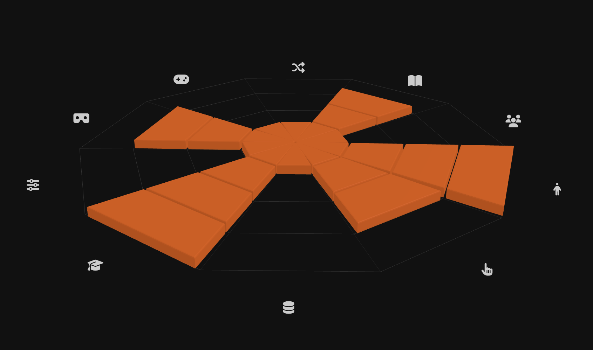

# Immersive Experience Design Taxonomy Chart

A 3D radar chart for visualizing the **[Immersive Experience Design Taxonomy](https://ieeexplore.ieee.org/document/9459328)** (Ruscella & Obeid, iLRN 2021). Built with [Three.js](https://threejs.org/).



The chart renders a 10-sector decagon grid representing the taxonomy dimensions. Experience profiles are displayed as extruded Nightingale (Coxcomb) shapes — each cell within a sector can be toggled independently, allowing non-cumulative level selection. Includes orbit camera controls and interactive cell toggling.

## Dimensions

| # | Dimension | Baseline (0) | Level 1 | Level 2 | Level 3 | Level 4 |
|---|-----------|-------------|---------|---------|---------|---------|
| 1 | Interactivity | None | Passive | Responsive | Manipulative | Creative |
| 2 | Embodiment | None | Visual Only | Partial Body | Full Body | Full Sensory |
| 3 | Co-Participation | None | Spectating | Parallel | Cooperative | Collaborative |
| 4 | Story | None | Background | Linear | Branching | Emergent |
| 5 | Dynamics | Static | Scripted | Reactive | Adaptive | Procedural |
| 6 | Gamification | None | Points/Badges | Challenges | Progression | Full Game |
| 7 | Immersive Tech | Screen | Surround Screen | HMD (3DoF) | HMD (6DoF) | Multi-Sensory |
| 8 | Meta Control | None | Preset Selection | Parameter Tuning | Scripting | Full Authoring |
| 9 | Didactic Capacity | None | Informational | Instructional | Constructivist | Transformative |
| 10 | Data | Anonymous | Identity | In-Game | Personalization | Biometrics |

Levels 1–4 are independent and can be toggled individually. The baseline label is shown when no levels are active.

## Quick Start

```bash
npm install
npm run dev
```

Open the printed URL to see the demo.

## Usage

```js
import { TaxonomyChart, ExperienceProfile } from 'immersive-experience-design-taxonomy-chart';

const chart = new TaxonomyChart(document.getElementById('chart'), {
  showLabels: true,
  editable: true,
  onChange: (id, scores) => console.log(id, scores),
});

chart.addProfile(
  new ExperienceProfile({
    name: 'Museum VR Tour',
    // Each entry is a sorted array of active levels (1-4) for that dimension.
    // An empty array [] means no levels active; [1, 3] means levels 1 and 3 active.
    scores: [[1, 2], [1, 2, 3], [1], [1, 2, 3], [1], [1], [1, 2, 3], [1], [1, 2, 3, 4], [1]],
    color: 0xff6600,
  }),
);
```

Legacy cumulative integer scores are also accepted and auto-expanded (e.g., `3` becomes `[1, 2, 3]`):

```js
new ExperienceProfile({
  name: 'Legacy Format',
  scores: [2, 3, 1, 3, 1, 1, 3, 1, 4, 1],
});
```

### Options

| Option | Type | Default | Description |
|--------|------|---------|-------------|
| `showLabels` | `boolean` | `true` | Show dimension name text next to axis icons. Icons are always visible. |
| `editable` | `boolean` | `false` | Enable click-to-toggle individual cells. |
| `onChange` | `(id, scores) => void` | `null` | Callback fired when a cell is toggled. Receives updated `number[][]` scores. |

### API

| Method / Property | Description |
|-------------------|-------------|
| `addProfile(profile)` | Add an `ExperienceProfile` to the chart. |
| `removeProfile(id)` | Remove a profile by id (animated). |
| `updateProfile(id, scores)` | Replace a profile's scores (crossfade animation). Accepts either format. |
| `clearProfiles()` | Remove all profiles. |
| `chart.editable` | Get/set whether click editing is enabled. |
| `chart.showLabels` | Get/set label text visibility. Icons enlarge when labels are hidden. |
| `setEditableProfile(id)` | Choose which profile responds to click editing (defaults to first). |
| `dispose()` | Tear down the chart and release resources. |

### Interactive Editing

When `editable` is true, click any cell to toggle it on or off. Levels within a dimension are independent — e.g., you can activate level 3 without level 2. Ghost (inactive) cells show a subtle outline on hover so you can see where to click. Orbit camera controls remain active (dragging rotates the view; only short clicks toggle cells).

### Score Format

Scores are stored as `number[][]` — an array of 10 sorted arrays, one per dimension. Each inner array contains the active level numbers (1–4). For example:

```
[[1, 2], [1, 3], [], [1, 2, 3, 4], ...]
```

- `[1, 2]` — levels 1 and 2 are active
- `[1, 3]` — levels 1 and 3 active (level 2 is not — non-cumulative)
- `[]` — no levels active

The `normalizeScores()` helper (also exported) converts between legacy integer format and the set-based format.

## Peer Dependencies

- [three](https://www.npmjs.com/package/three) >= 0.150.0

## License

See repository root.
